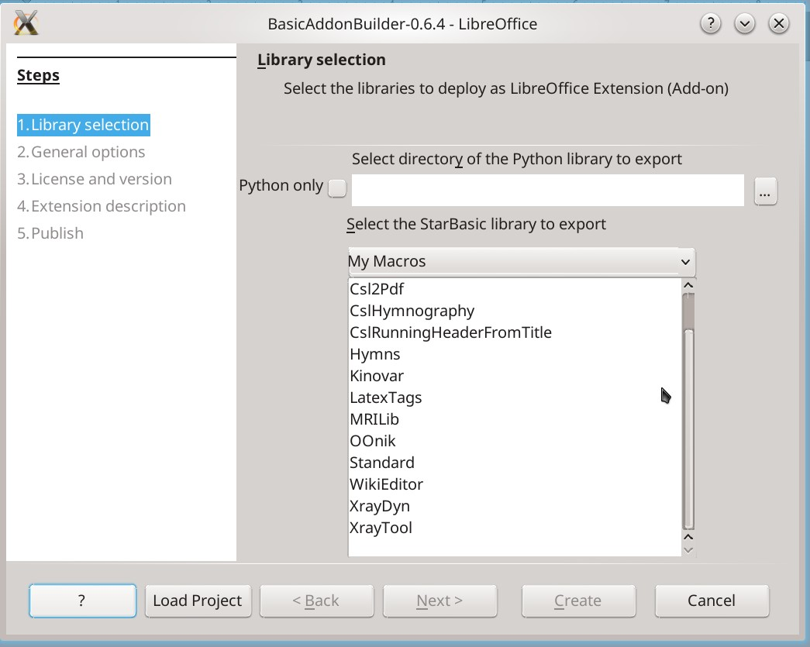
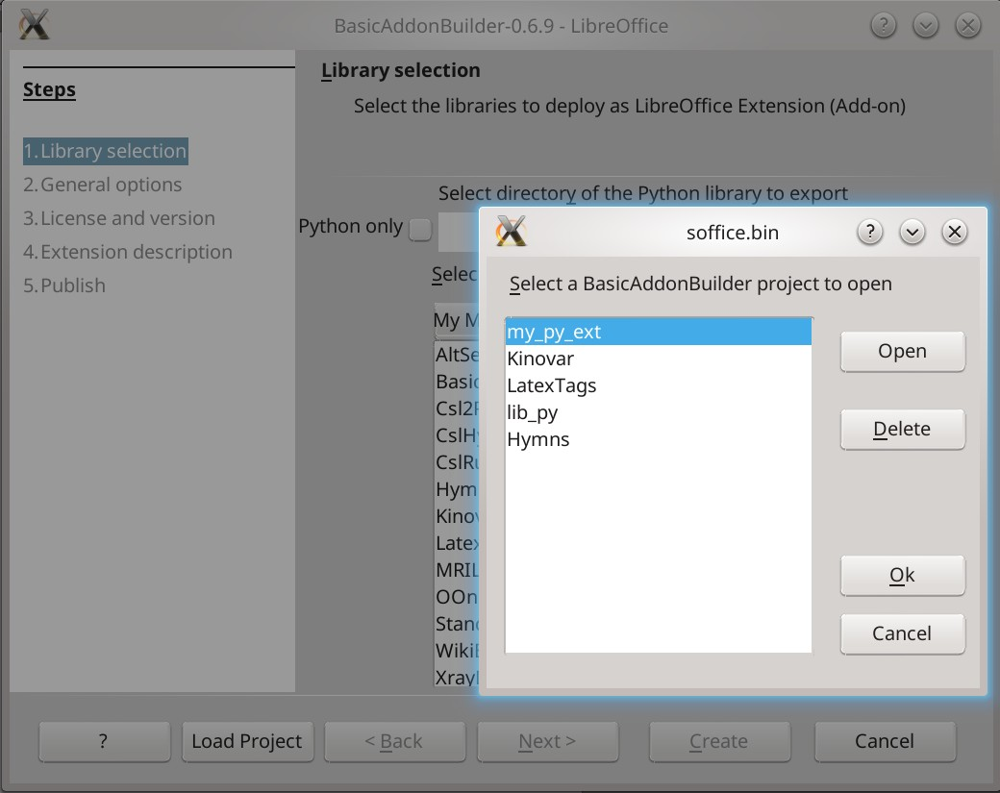
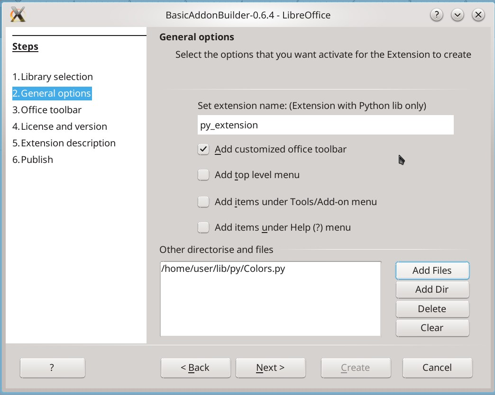
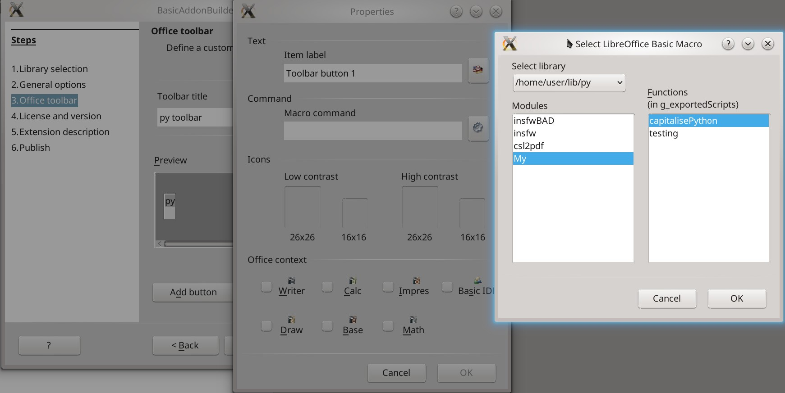
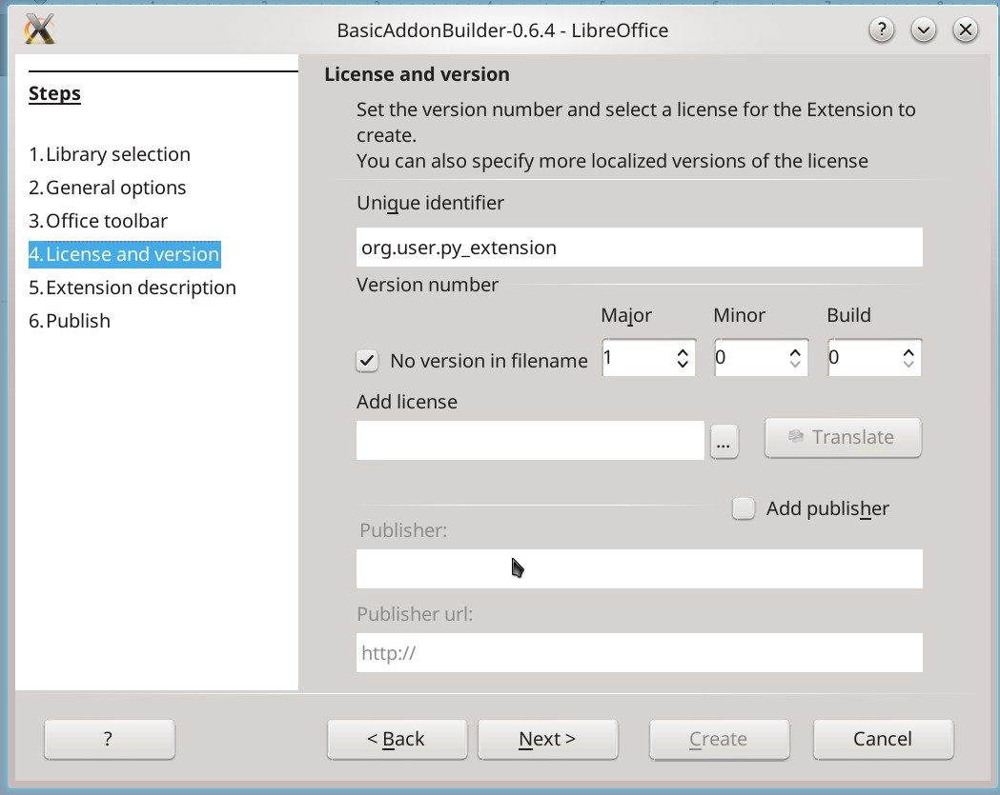
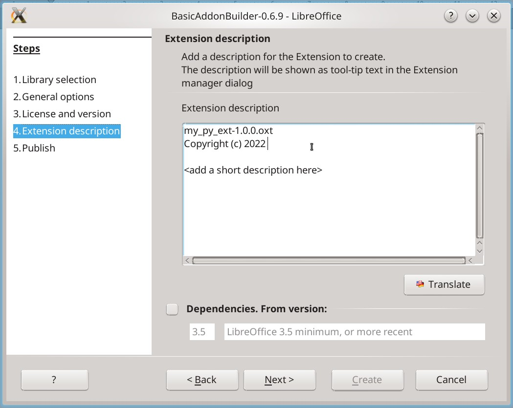
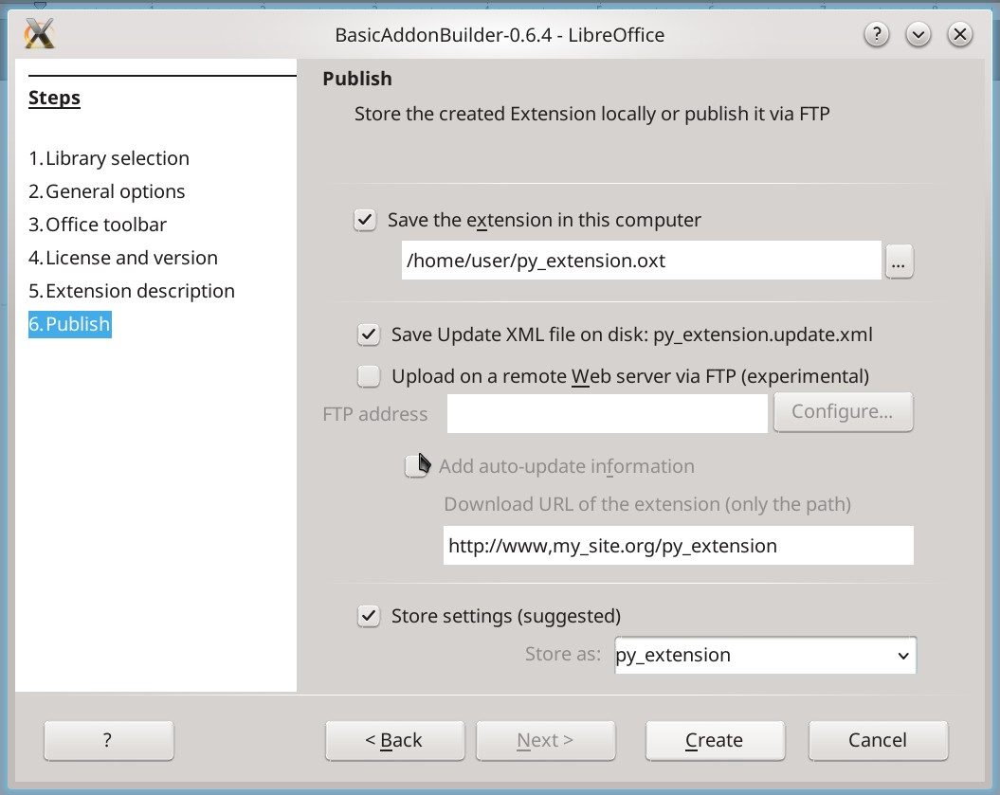

# BasicAddonBuilder_LibreOffice7 

`LibreOffice` extension for extension compiling.  

Known instrument from **Paolo Mantovani,** fixed for `LO ver >= 7.1`.

Fixed: toolbar buttons adding.

Finished a feature started by author - **save and load settings of project** (in LO-registry).

### Added features

- Optional creating Update XML file in extension creation dir.
- Optional removing version from extension filename (version is present in the extension itself).  
- Minimal LO version.
- Python Libraries support.  
- Add other directories and files to extension.
### Python Libraries support

You can select directory with python modules. This directory's structure must be prepared (remember about `pythonpath` directory for other modules). Then it will be copied to extension root and renamed to `python`.  

Extension's name must be set manually if only Python library selected (if both selected - Basic and Python - extension named from Basic library automatically).

Functions from python modules are available for mapping on toolbar or menus creation steps. This functions must be into `g_exportedScripts = ...`.

### Add other directories and files to extension
Add only latin-named files and directories.  
`ZipFolder` function decodes as url-encoded all non-latin names:  
`%D0%9F%D1%80%D0%BE%D0%B2%D0%B5%D1%80%D0%BA%D0%B0 = "Проверка"`.

### Screenshots
  

  

  

  

  

  

### TODO:
- HotKeys.